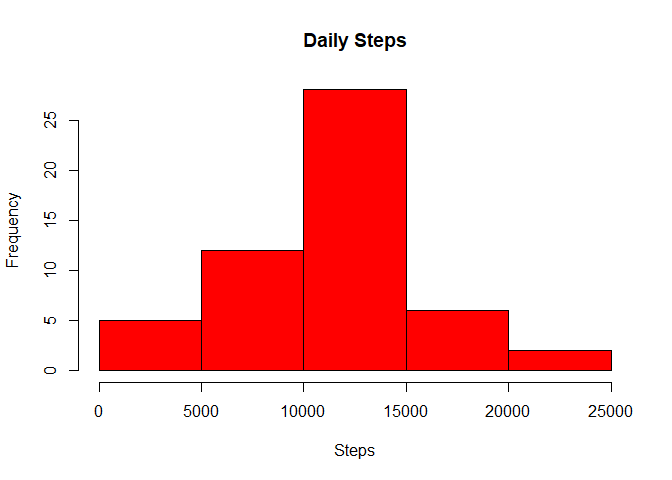
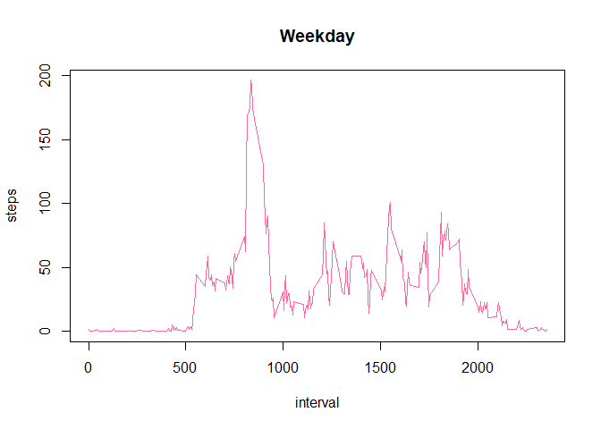
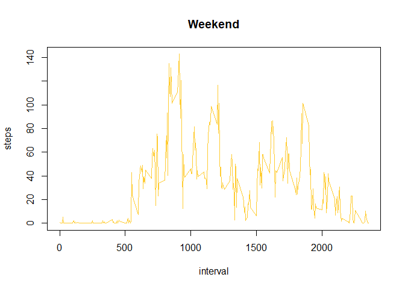

## Loading and preprocessing the data

```r
data <- read.csv('activity.csv')
summary(data)
```

```
##      steps            date              interval     
##  Min.   :  0.00   Length:17568       Min.   :   0.0  
##  1st Qu.:  0.00   Class :character   1st Qu.: 588.8  
##  Median :  0.00   Mode  :character   Median :1177.5  
##  Mean   : 37.38                      Mean   :1177.5  
##  3rd Qu.: 12.00                      3rd Qu.:1766.2  
##  Max.   :806.00                      Max.   :2355.0  
##  NA's   :2304
```
## What is mean total number of steps taken per day?


```r
# Let check the mean number of steps taken per day using tapply
steps_daily <- tapply(data$steps, data$date, sum)

# Create a plot to visualise the distrubution of two features
hist(steps_daily, xlab = 'Steps', ylab='Frequency', col='red', main = 'Daily Steps')
```

<!-- -->


Let's calculate the mean and median of the total number of steps per day 


```r
mean_step <- mean(steps_daily, na.rm = TRUE) ## remove any na values
mean_step
```

```
## [1] 10766.19
```

```r
med_step <- median(steps_daily, na.rm = TRUE)
med_step
```

```
## [1] 10765
```

## What is the average daily activity pattern?

```r
step_pattern <- aggregate(steps ~ interval, data, mean)
plot(step_pattern$interval, step_pattern$steps, type = 'l', xlab = '5 minutes interval', ylab = 'Average step all day', main = 'Average Daily Steps Pattern')
```

<!-- -->

```r
step_pattern$interval[which.max(step_pattern$steps)]
```

```
## [1] 835
```
The 5 minutes interval contains the maximum number of step is 8:35am with 835 steps.

## Imputing missing values

Note that there are a number of days/intervals where there are missing values (coded as NA). The presence of missing days may introduce bias into some calculations or summaries of the data.

Examine and report the total nuber of missing values in the data


```r
null_val <- sum(!complete.cases(data))
null_val
```

```
## [1] 2304
```
The total number of missing value is 2304.

We will develop a strategy for filling in all of the missing values in the dataset by creating a copy of the original dataset but with the missing values being filled in.


```r
copy_data <- data

copy_data[is.na(copy_data$steps), 'steps'] <- 0 # na value will b 0
```

Calculate the total steps per day with histogram visualisation


```r
# Let check the mean number of steps taken per day using tapply
steps_daily_2 <- tapply(copy_data$steps, copy_data$date, sum)

# Create a plot to visualise the distrubution of two features
hist(steps_daily_2, xlab = 'Steps', ylab='Frequency', col='red', main = 'New Daily Steps', breaks =10)
```

<!-- -->


Repeat the same steps from above to calculate the mean and median total number of steps per day, but with the copy_data


```r
mean_step_2 <- mean(steps_daily_2, na.rm = TRUE) 
mean_step_2
```

```
## [1] 9354.23
```

```r
med_step_2 <- median(steps_daily_2, na.rm = TRUE)
med_step_2
```

```
## [1] 10395
```
There are no difference between the mean and median when we use the with or without na values data.


## Are there differences in activity patterns between weekdays and weekends?

Create a new factor variable in the dataset with two levels – “weekday” and “weekend” indicating whether a given date is a weekday or weekend day.

Let's choose 1 as Mon 


```r
copy_data$day <- as.POSIXlt(copy_data$date)$wday
copy_data$t_day <- as.factor(ifelse(copy_data$day == 0 | copy_data$day == 1, 'weekend', 'weekday'))
copy_data <- subset(copy_data, select = -c(day))

head(copy_data)
```

```
##   steps       date interval   t_day
## 1     0 2012-10-01        0 weekend
## 2     0 2012-10-01        5 weekend
## 3     0 2012-10-01       10 weekend
## 4     0 2012-10-01       15 weekend
## 5     0 2012-10-01       20 weekend
## 6     0 2012-10-01       25 weekend
```

Make a panel plot containing a time series plot (i.e. type = "l") of the 5-minute interval (x-axis) and the average number of steps taken, averaged across all weekday days or weekend days (y-axis).


```r
wd_dat <- copy_data[copy_data$t_day == 'weekday',]
wk_dat <- copy_data[copy_data$t_day == 'weekend',]

wd_step_pattern <- aggregate(steps ~ interval, wd_dat, mean)
wk_step_pattern <- aggregate(steps ~ interval, wk_dat, mean)


plot(wd_step_pattern, type = 'l', col='#FF6699', main ='Weekday')
```

<!-- -->


```r
plot(wk_step_pattern, type = 'l', col='#FFCC33', main ='Weekend')
```

<!-- -->

There is a clear difference of the step pattern between weekday and weekend. 

During weekday, the earliest activity is in the morning from 5:00am and peak at about 9am, which drastically decrease in the afternoon. 

In contrast, we see a later start on the weekend, however, the activity is more steady throughout the whole day (almost at the same level at peak time)
